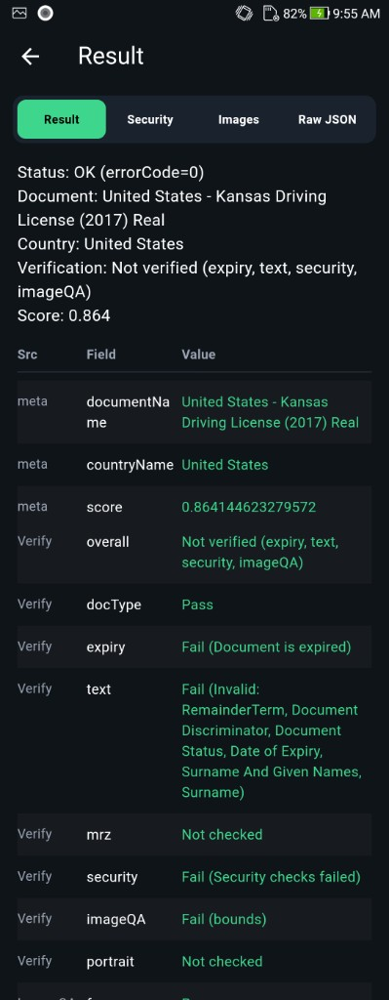
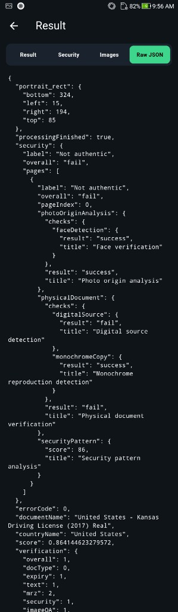

<div align="center">

</div>

#### 🌐 Company Site - [Here](https://faceplugin.com)
#### 🤗 Hugging Face - [Here](https://huggingface.co/FacePlugin-Ltd)
#### 🛟 Help Center - [Here](https://doc.faceplugin.com)
#### 🐳 Docker Hub - [Here](https://hub.docker.com/u/faceplugin)

# FacePlugin ID Document Recognition SDK — Flutter (Fully On-Premise)

> Drop Android AAR + iOS framework → run on a **physical** phone (~15 min after Flutter is installed).
> Jump: [Quick Start](#quick-start) · [Get the runtimes](#get-the-runtimes) · [Run the demo](#run-the-demo) · [License](#sdk-license) · [Integrate](#setup-on-your-own-app)

## Quick Start

Use this for the **example app** (check each box in order).

- [ ] Clone [ID-Document-Recognition-Flutter](https://github.com/Faceplugin-ltd/ID-Document-Recognition-Flutter)
- [ ] `flutter doctor` clean; **Flutter 3.44+**, Dart **3.3+**, **JDK 17**
- [ ] Download runtimes — [Get the runtimes](#get-the-runtimes)
- [ ] Android: `documentreadersdk.aar` → `example/android/libdocsdk/`
- [ ] iOS: `docsdk.framework` → `ios/Frameworks/docsdk.framework`
- [ ] Repo root: `dart run tool/bootstrap.dart`
- [ ] iOS (macOS): `cd example/ios && pod install` → set **your** Xcode Signing Team
- [ ] Keep demo ids: Android `com.faceplugin.documentreader` / iOS `com.faceplugin.documentreader.app` (until **12 Aug 2027**)
- [ ] `cd example && flutter run` on a **physical** phone
- [ ] Home status bar shows **Ready** → Camera / Gallery / About

> Own app? → [Setup on your own app](#setup-on-your-own-app) (AAR: `android/libs/`). Full integration: [https://doc.faceplugin.com](https://doc.faceplugin.com)

## Introduction

FacePlugin **ID Document Recognition SDK for Flutter** is a fully on-device identity verification plugin for Android and iOS. Scan ID cards, passports, and driver licenses with OCR, MRZ, barcode and QR extraction, live camera overlay, gallery front/back, authenticity / document liveness, and Result / Security / Images / Raw JSON. Package: `document_reader_sdk`. The repository root is the plugin; `example/` is the demo UI.

All processing stays on the device. **No** biometric data is sent to FacePlugin cloud — built for KYC, eKYC, and cross-platform mobile onboarding.

Native binaries are **not** on GitHub. Download them from Google Drive (links below).

### Main Functionalities

| Feature | Supported |
| ------- | --------- |
| ID Card, Passport, and Driver License recognition | ✓ |
| MRZ, Barcode, QR, and OCR data extraction | ✓ |
| Live camera locate overlay + Capture | ✓ |
| Gallery (front required, back optional) | ✓ |
| Result (fields, Security, images, JSON) | ✓ |
| Authenticity / Security (document liveness) | ✓ |
| About | ✓ |

### Product List

| Platform | Repository |
|----------|------------|
| Android | [ID-Document-Recognition-Android](https://github.com/Faceplugin-ltd/ID-Document-Recognition-Android) |
| iOS | [ID-Document-Recognition-iOS](https://github.com/Faceplugin-ltd/ID-Document-Recognition-iOS) |
| Windows | [ID-Document-Recognition-Windows](https://github.com/Faceplugin-ltd/ID-Document-Recognition-Windows) |
| Linux / Docker | [ID-Document-Recognition-Docker](https://github.com/Faceplugin-ltd/ID-Document-Recognition-Docker) |
| React Native | [ID-Document-Recognition-React-Native](https://github.com/Faceplugin-ltd/ID-Document-Recognition-React-Native) |
| **Flutter** | **[ID-Document-Recognition-Flutter](https://github.com/Faceplugin-ltd/ID-Document-Recognition-Flutter)** (**this repo**) |
| Ionic Capacitor | [ID-Document-Recognition-Ionic-Capacitor](https://github.com/Faceplugin-ltd/ID-Document-Recognition-Ionic-Capacitor) |
| Ionic Cordova | [ID-Document-Recognition-Ionic-Cordova](https://github.com/Faceplugin-ltd/ID-Document-Recognition-Ionic-Cordova) |
| Linux / Docker (Liveness) | [ID-Document-Liveness-Detection-Docker](https://github.com/Faceplugin-ltd/ID-Document-Liveness-Detection-Docker) |


---

## Before you start

| Step | What you need |
| ---- | ------------- |
| 1 | **Flutter 3.44+** (`pubspec.yaml`), Dart **3.3+**, **JDK 17**. iOS: **macOS + Xcode 15+**. Prefer a **physical** phone |
| 2 | Android `documentreadersdk.aar` and iOS `docsdk.framework` — [Get the runtimes](#get-the-runtimes) |
| 3 | Demo licenses are in `example/lib/core/constants/license.dart` (Android `com.faceplugin.documentreader`, iOS `com.faceplugin.documentreader.app`, valid until **12 August 2027**). Request a new key only if you change `applicationId` / bundle id — [SDK License](#sdk-license) |

Camera and Gallery unlock when the status bar shows **Ready**.

### System requirements

| Item | Android | iOS |
| ---- | ------- | --- |
| Host | Windows / macOS / Linux; **JDK 17** | **macOS only**; Xcode **15+**, CocoaPods |
| Flutter | **3.44+** (`flutter: ">=3.44.0"`); Dart **3.3+** | Same |
| OS | `minSdk` **24**; plugin `compileSdk` **36**; Android **10+** recommended | **15.0** (`Podfile` / `IPHONEOS_DEPLOYMENT_TARGET`) |
| Device | Physical phone (emulator limited) | Physical iPhone |
| Camera | Rear camera | Rear camera, autofocus |
| Demo id | `com.faceplugin.documentreader` | `com.faceplugin.documentreader.app` |

The example disables SwiftPM (`enable-swift-package-manager: false`) because path folder names often differ from `document_reader_sdk` ([flutter#186881](https://github.com/flutter/flutter/issues/186881)).

---

## Get the runtimes

Binaries are gitignored. Copy them **before** your first build.

### Android — `documentreadersdk.aar`

**Download:** [DocumentReader Android runtime (Google Drive)](https://drive.google.com/drive/folders/1nDSfvj0WtC1lZgzwFd7471ECVtk-nuYH)

**For the example app**, place the AAR here:

```text
ID-Document-Recognition-Flutter/
└── example/
    └── android/
        └── libdocsdk/
            └── documentreadersdk.aar    ← required
```

**For your own app** (after integration), copy the AAR here instead:

```text
YourApp/
└── .../
    └── document_reader_sdk/
        └── android/
            └── libs/
                └── documentreadersdk.aar    ← required
```

Gradle fails fast if the AAR is missing (`example/android/libdocsdk/` for the demo, or `android/libs/` for your app).

### iOS — `docsdk.framework` (+ `docsdk.xcframework`)

**Download:** [DocumentReader iOS runtime (Google Drive)](https://drive.google.com/drive/folders/1do6Ws_BlXGkR_K9jI_ULd1zHjqLGSP4q) — unzip if needed.

Engine is nested inside `docsdk.framework/Frameworks/` (`dcrcore.framework`). Place:

```text
ios/Frameworks/docsdk.framework/     ← from Drive
ios/Frameworks/docsdk.xcframework/   ← from bootstrap / pod install
```

On macOS, after copy: `dart run tool/bootstrap.dart` or `cd example/ios && pod install`.

---

## Run the demo

### 1. Clone and place runtimes

```bash
git clone https://github.com/Faceplugin-ltd/ID-Document-Recognition-Flutter.git
cd ID-Document-Recognition-Flutter
```

- Android: `example/android/libdocsdk/documentreadersdk.aar`
- iOS: `ios/Frameworks/docsdk.framework`

See [Get the runtimes](#get-the-runtimes).

### 2. Bootstrap

```bash
dart run tool/bootstrap.dart
```

### 3. iOS pods (macOS)

```bash
cd example/ios && pod install && cd ../..
```

Set **your** Signing Team in Xcode. Keep bundle id `com.faceplugin.documentreader.app` for the demo license.

### 4. Run

```bash
cd example && flutter run
```

### 5. Use the demo

Home status → **Ready**, then Camera / Gallery → Result (home: one row under title — **Camera** | **Gallery** | **About**). Camera uses a live locate overlay; tap **Capture** when score ≥ 50% to run on-device OCR, MRZ, barcode, and authenticity checks. Gallery: Front required, Back optional. Result tabs: **Result** / **Security** / **Images** / **Raw JSON**.

| Platform | Identifier |
| -------- | ---------- |
| Android `applicationId` | `com.faceplugin.documentreader` |
| iOS bundle id | `com.faceplugin.documentreader.app` |

### Screenshots

<p align="center">

&nbsp;

&nbsp;

</p>

<p align="center">

&nbsp;

&nbsp;

</p>

<p align="center">

&nbsp;

</p>

---

## SDK License

Licenses are **offline** and bound to your `applicationId` / bundle identifier.

The sample app already includes a valid key for `com.faceplugin.documentreader` (Android) / `com.faceplugin.documentreader.app` (iOS) (until **12 August 2027**). You only need a new key if you use a different `applicationId` or bundle identifier.

### How to get a license

The code below shows how to use the license:

[https://github.com/Faceplugin-ltd/ID-Document-Recognition-Flutter/blob/9286b7e2db49eb1168c15b492c05854093b4e66b/example/lib/core/constants/license.dart#L9-L15](https://github.com/Faceplugin-ltd/ID-Document-Recognition-Flutter/blob/9286b7e2db49eb1168c15b492c05854093b4e66b/example/lib/core/constants/license.dart#L9-L15)

[https://github.com/Faceplugin-ltd/ID-Document-Recognition-Flutter/blob/9286b7e2db49eb1168c15b492c05854093b4e66b/example/lib/services/sdk_service.dart#L25-L39](https://github.com/Faceplugin-ltd/ID-Document-Recognition-Flutter/blob/9286b7e2db49eb1168c15b492c05854093b4e66b/example/lib/services/sdk_service.dart#L25-L39)

Please [contact us](#contact) to get a license for **your own app**.

### License capabilities (Recognition + Liveness)

After activation, `getLicenseStatus` reports what the key unlocks. Home shows the same summary on the status bar (for example **Ready · Recognition + Liveness**). About shows **License: …**.

| Capability | Meaning |
| ---------- | ------- |
| **Recognition** | OCR, MRZ, barcode/QR, and document type classification |
| **Liveness** (authenticity) | Document authenticity: physical document, security patterns, photo origin, barcode format |

Typical labels:

- **Recognition + Liveness** — full identity verification (Result + Security tabs)
- **Recognition** — OCR, MRZ, and barcode only; Security stays empty / not checked
- **Liveness** — authenticity / document liveness only; OCR/MRZ/barcode stays empty / not checked
- **Not licensed** — until you activate

---

## Setup on your own app

You need the `document_reader_sdk` package, the native runtimes, and a few lines of Dart. You do **not** need the example screens.

### 1. Add the package

```yaml
dependencies:
  document_reader_sdk:
    git:
      url: https://github.com/Faceplugin-ltd/ID-Document-Recognition-Flutter.git
```

Then `flutter pub get`, `cd ios && pod install`, and **rebuild** the native app.

### 2. Copy native runtimes

| Platform | Copy to |
| -------- | ------- |
| Android AAR | `<document_reader_sdk>/android/libs/documentreadersdk.aar` |
| iOS framework | `<document_reader_sdk>/ios/Frameworks/docsdk.framework` |

### 3. Activate and recognize

```dart
import 'package:document_reader_sdk/document_reader_sdk.dart';

Future<void> boot() async {
  final machine = await getMachineCode(); // FPMC1.…
  final act = await setActivation('FP1.…'); // bound to applicationId / bundle id
  if (act != sdkSuccess) {
    print(await lastLicenseError());
    return;
  }
  final code = await init();
  if (code != sdkSuccess) return;

  final locateJson = await locateDocument(imagePath);
  final resultJson = await recognize(frontPath, backPath, true);
}
```

Full wiring, permissions, and result JSON: [https://doc.faceplugin.com](https://doc.faceplugin.com)

---

## About SDK

Call order: `getMachineCode` → `setActivation` → `init` → `getLicenseStatus` → `recognize` / `locateDocument`. Status `0` (`sdkSuccess`) means activate / init succeeded.

| API | Description |
| --- | ----------- |
| `getMachineCode()` / `setActivation(license)` / `init()` / `deinit()` | License + engine lifecycle |
| `getLicenseStatus()` | Recognition / Liveness flags + label |
| `locateDocument(image)` | Live locate JSON + corner geometry |
| `recognize(front, [back, authenticity])` | OCR / MRZ / barcode — canonical JSON |
| `recognizeResult(...)` | Typed `DocResult` |
| `lastLicenseError()` | Last license error string |

Status codes: `sdkSuccess` (0), `sdkLicenseInvalid` (1), `sdkLicenseExpired` (2), `sdkNotActivated` (3), `sdkInitFailed` (4).

Image input: file path, `file://` URI, content URI, or base64 / `data:` URL.

---

## Contact

<div align="left">
<a target="_blank" href="mailto:info@faceplugin.com"></a>&emsp;
<a target="_blank" href="https://wa.me/+14692784822"></a>
</div>
